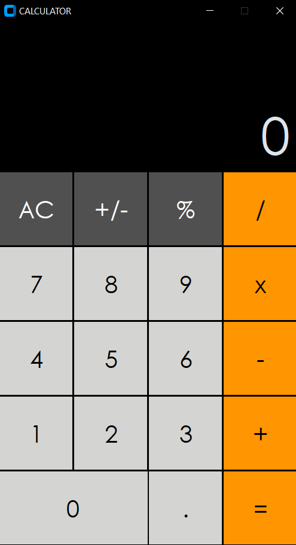
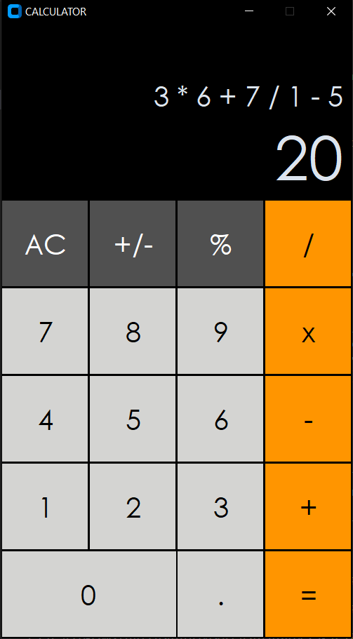
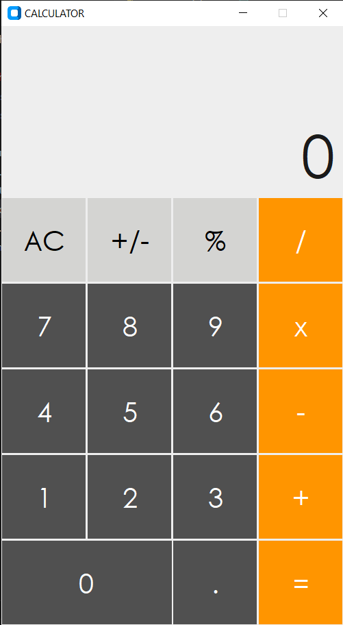
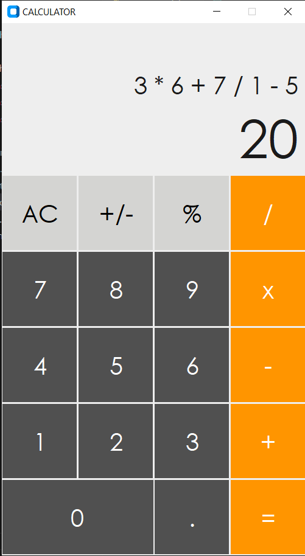

# Calculator Project

## Overview

This project is a calculator implemented in Python using the Tkinter module specifically customtkinter. It provides a graphical user interface with basic calculator functionalities.
this calculator layout in inspired from **mac ios calculator**.

## Features

- Addition, subtraction, multiplication, and division operations.
- Clear button to reset the input.
- Automattically changes into light of dark theme based on the systems theme

## Screenshots and Video
### Dark theme


### White theme


[Watch the project demo video](videos/demo.mp4)

## Getting Started

# Project Structure

+ calculator.py:  Main Python file for the calculator application.

+ cal-setting.py: Submodule for defining the layout of the calculator.

+ buttons.py: Submodule for designing the buttons and creating the buttons.

+ requirements.txt: File specifying the project dependencies.


### Prerequisites

Make sure you have Python installed. You can download it from [python.org](https://www.python.org/).

### Installation

1. Clone the repository:

```bash

    git clone https://github.com/your-username/calculator-project.git

    cd calculator-project

    pip install -r requirements.txt

    python calculator.py

